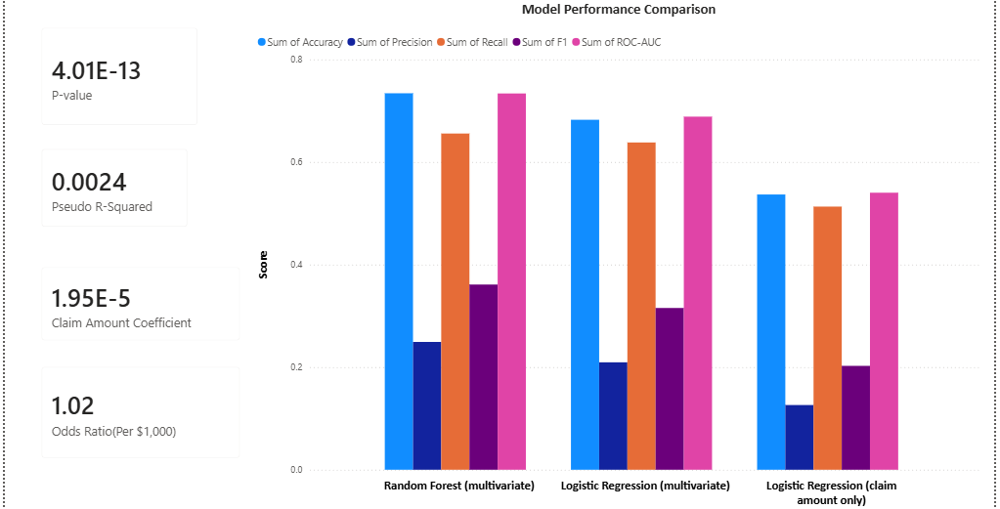
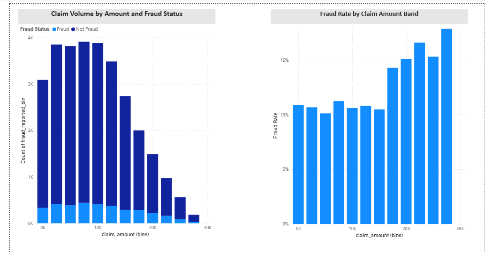
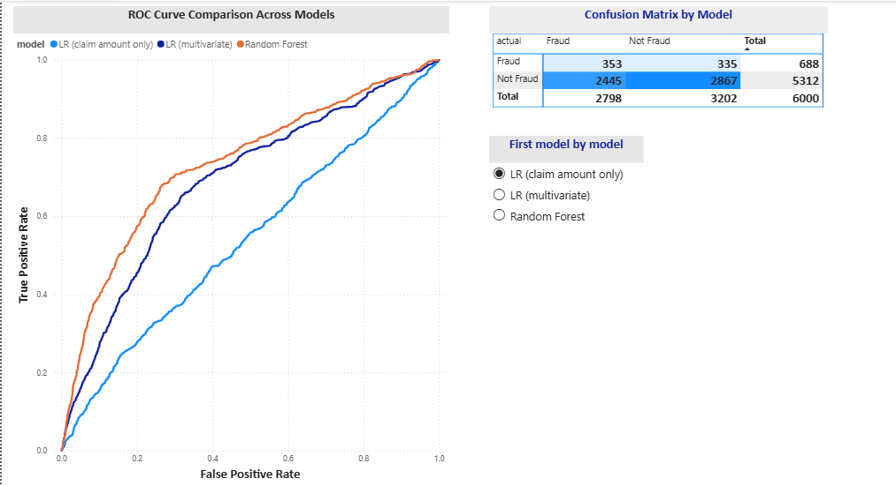

# Auto Insurance Fraud Detection

Does the total claim amount significantly predict whether an auto insurance claim is fraudulent? This project tests that question statistically, then extends it with a multivariate comparison, on a 30,000-record Kaggle dataset.

Built as the capstone project for WGU's B.S. Data Analytics program (D502/D195).

## Questions this project answers

**Core research question:** Does claim amount significantly predict fraud outcome in auto insurance claims?

That question breaks down into a few more specific ones the analysis and dashboard work through:

- **Is the relationship statistically significant?** Yes — at n = 30,000, claim amount is a statistically significant predictor of fraud (p < .001).
- **Is that effect practically meaningful, or just statistically detectable?** Practically small — an odds ratio of ~1.02 per $1,000 in claim amount, and a pseudo R² of 0.002. Statistical significance and practical significance turn out to be different questions with different answers here.
- **How well can claim amount alone classify a claim as fraudulent?** Not well — a univariate logistic regression on claim amount alone only reaches ROC-AUC ≈ 0.54, barely better than chance.
- **Does adding more claim details improve prediction?** Yes, substantially — bringing in incident severity, witnesses, and authorities contacted lifts a random forest to ROC-AUC ≈ 0.72.
- **Which model performs best, and by how much?** Compared across accuracy, precision, recall, F1, and ROC-AUC, the random forest outperforms both the univariate and multivariate logistic regressions (see the Model Diagnostics dashboard page).
- **How does fraud rate vary with claim amount?** Fraud rate rises noticeably in the higher claim-amount bands (see the Claim Patterns dashboard page).
- **Can the dataset itself be trusted as real-world claims data?** Only partially — it shows signs consistent with synthetic generation (near-uniform category distributions, near-random state matching, placeholder-style city names), which caps how much genuine signal any model can extract from it.

## Key findings

- Claim amount alone is a **statistically significant** predictor of fraud (p < .001, n = 30,000), but the effect is **practically small**: an odds ratio of about 1.02 per $1,000 in claim amount, and a univariate logistic regression only reaches ROC-AUC ≈ 0.54.
- Extending the model with the dataset's other fields (incident severity, witnesses, authorities contacted) lifts a random forest to ROC-AUC ≈ 0.72.
- The dataset shows several characteristics consistent with synthetic generation (near-uniform category distributions, near-random state matching between policy and incident location, placeholder-style city names), which caps how much genuine signal any model can extract from it. This is discussed directly in the notebook rather than glossed over.

## Dashboard preview

Interactive Power BI dashboard (`dashboard/fraud_detection_dashboard.pbix`) with three pages: Overview, Claim Patterns, and Model Diagnostics.

**Model Performance Overview** — hypothesis test KPIs (p-value, pseudo R², odds ratio) alongside accuracy/precision/recall/F1/ROC-AUC across all three models.



**Claim Patterns** — claim volume by amount and fraud status, and fraud rate by claim amount band.



**Model Diagnostics** — ROC curve comparison across models and a confusion matrix by model.



## Repo structure

```
auto-insurance-fraud-detection/
├── notebooks/
│   └── fraud_detection_analysis.ipynb   # Full analysis, runs end to end
├── data/
│   ├── raw/                             # Original Kaggle CSV
│   └── processed/                       # Cleaned dataset
├── outputs/                             # Model comparison table, charts, exported predictions
├── dashboard/                           # Power BI dashboard file
├── docs/
│   └── screenshots/                     # Dashboard preview images
└── requirements.txt
```

## Methodology

1. **Data Understanding** — explored all 24 fields, checked class balance (~11.5% fraud), screened every field against fraud with point-biserial correlation and chi-square tests.
2. **Data Preparation** — recoded the one field with missing values, engineered a couple of light features, dropped identifier/noise columns.
3. **Modeling** — a univariate logistic regression (claim amount only) as the direct hypothesis test, via `statsmodels`, then a multivariate logistic regression and random forest via `scikit-learn` as an extended comparison.
4. **Evaluation** — accuracy, precision, recall, F1, ROC-AUC, and PR-AUC across all three models, benchmarked against results reported in comparable published studies.

## Tools

Python 3, pandas, scikit-learn, statsmodels, matplotlib/seaborn for the analysis. Power BI Desktop for the interactive dashboard.

## Data source

Ahluwalia, S. (2025). *Car insurance fraud detection dataset* [Data set]. Kaggle. https://www.kaggle.com/datasets/ahluwaliasaksham/car-insurance-fraud-detection-dataset

## Running it locally

```bash
git clone https://github.com/Emyroyale/auto-insurance-fraud-detection.git
cd auto-insurance-fraud-detection
python -m venv venv
source venv/bin/activate   # venv\Scripts\activate on Windows
pip install -r requirements.txt
jupyter notebook notebooks/fraud_detection_analysis.ipynb
```

## Author

Emy Kirugo — [github.com/Emyroyale](https://github.com/Emyroyale)
